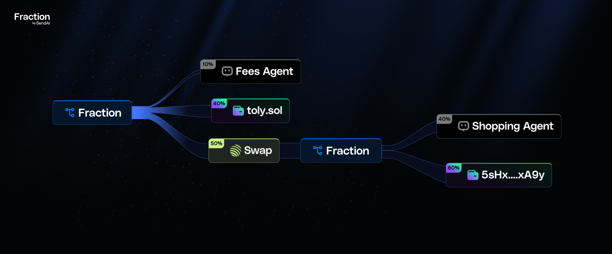

# Fraction

*built for agents & apps*

### How It Works

- You create a `fraction_config` which defines how funds should flow
- Anyone can send money to this `fraction_config` address
- A cranker, checks and intiates `claim` transaction which distributes all funds present according to the intial config defined.

**[View SDK Documentation →](./sdk/README.md)**

## Distribution Mechanics

When the authorized agent executes distribution:
- Agent receives 0.05% as protocol fee
- Participants receive split according to configured percentages
- All transfers occur atomically in single transaction
- Treasury is emptied completely
- No manual withdrawal steps required

## Audited by Sec3

All contracts are open-source with reproducible builds. Code is formally verified and independently [audited by Sec3](./audits/sec3-sept-2025.pdf).

## Program Information

**Program ID (Mainnet)**: `FracVQuBhSeBvbw1qNrJKkDmcdPcFYWdneoKbJa3HMrj`
**Program ID (Devnet)**: `FracVQuBhSeBvbw1qNrJKkDmcdPcFYWdneoKbJa3HMrj`

## Example real world use-cases

**Consumer Applications**  - Enables revenue split, payrolls for your employees or subscription.

**Autonomous Agents**  - Instantly split revenue with agents running task for you.

**Token Launchpads**  - Automate token sale proceeds and treasury allocations.

split any transaction into fraction.

### Deployment

**Devnet**: `FracVQuBhSeBvbw1qNrJKkDmcdPcFYWdneoKbJa3HMrj`

**Mainnet**: `FracVQuBhSeBvbw1qNrJKkDmcdPcFYWdneoKbJa3HMrj`

## License

This project is licensed under the MIT License - see the [LICENSE](LICENSE) file for details.
