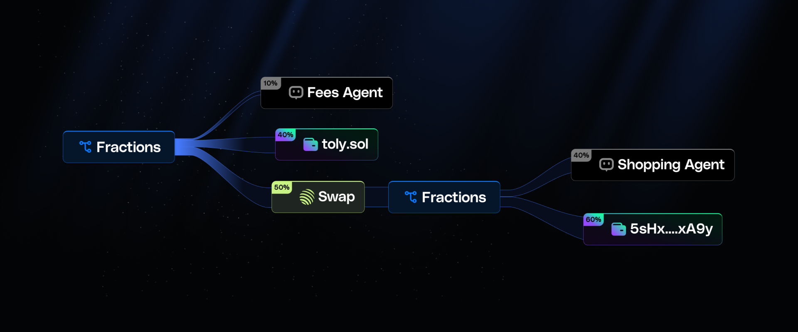

# Fraction

On-chain infrastructure for automated revenue splits and treasury management on Solana.

Built for agentic workflows and consumer apps.

<!-- Image placeholder for product demonstration -->


## Real-World Workflows

Power applications with instant revenue splits, automated treasury management, and on-chain execution in minutes.

**Consumer Applications**  
Power apps with subscriptions, payroll, and instant revenue splits.

**Autonomous Agents**  
On-chain bots that execute transfers, manage treasuries, and enforce distribution rules.

**Token Launchpads**  
Automate token sale proceeds, vesting schedules, and treasury allocations.

**Payment Infrastructure**  
On-chain rails for instant payments, atomic settlements, and recurring distribution flows.

## How It Works

### Deposit and Split Transactions

When funds are deposited into a shared treasury, an on-chain agent executes the distribution, allocating each participant their exact fraction (% share) without manual intervention.

```
Treasury Deposit → Agent Execution → Instant Distribution
```

The protocol ensures atomic settlement with zero manual intervention, supporting both one-time and recurring distribution patterns.

## Integrate in Under 10 Minutes

Plug in with our TypeScript SDKs and pre-built React components. Go from install to live integration in under 10 minutes. A flat 0.05% protocol fee applies.

**[View SDK Documentation →](./sdk/README.md)**

## Technical Architecture

### Core Components

**Fraction Config**: Program Derived Account storing participant details and authorized agent wallet
**Treasury**: Associated Token Account holding funds for distribution  
**Agent Execution**: Automated distribution triggered by designated agent wallet

### Protocol Instructions

**Initialize**: Create revenue split configuration with up to 5 participants
**Update**: Modify participant shares and agent wallet (admin only)
**Distribute**: Execute atomic distribution to all participants (agent only)

### Distribution Mechanics

When the authorized agent executes distribution:
- Agent receives 2% protocol fee
- Participants receive 98% split according to configured percentages
- All transfers occur atomically in single transaction
- Treasury is emptied completely
- No manual withdrawal steps required

## Trusted, Audited & Open-Source

All contracts are open-source with reproducible builds. Code is formally verified and independently audited by Sec3.


### Security Features

**Access Control**: Admin-only configuration updates, agent-only distribution execution
**PDA Security**: Proper seed validation and account ownership verification
**Atomic Transfers**: All distributions occur in single transaction with rollback protection
**Mathematical Precision**: Basis points system ensures accurate percentage calculations
**Account Validation**: Comprehensive constraint checking via Anchor framework

## Program Information

**Program ID**: `Ck2PtB73t36kjk4mLUztwsBV9jvq7q3mGfSNmQevwFgg`

### Development

```bash
# Clone repository
git clone <repository-url>
cd fraction

# Install dependencies
yarn install

# Build program
anchor build

# Run tests
anchor test
```

### Deployment

**Devnet**: `Ck2PtB73t36kjk4mLUztwsBV9jvq7q3mGfSNmQevwFgg`
**Mainnet**: `Ck2PtB73t36kjk4mLUztwsBV9jvq7q3mGfSNmQevwFgg` 

## Documentation

**[Technical Documentation](./FLOW.md)** - Detailed protocol specification and implementation guide
**[SDK Documentation](./sdk/README.md)** - TypeScript SDK and integration examples

## License

This project is licensed under the MIT License - see the [LICENSE](LICENSE) file for details.
